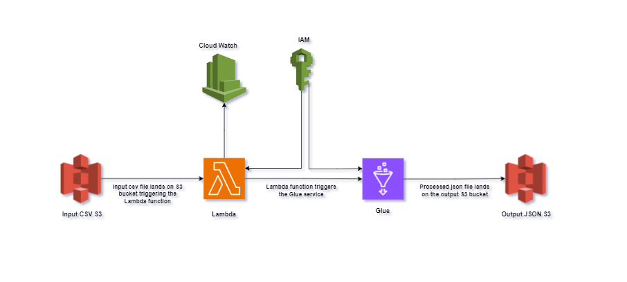

# 🚀 AWS-DataEngineering-Pipeline

## 📚 Overview

**AWS Data Pipeline Framework** is a comprehensive solution for building and managing AWS data pipelines. This project integrates AWS Glue, Lambda, S3, IAM, and CloudWatch to demonstrate automated ETL processes, secure data handling, and robust monitoring.

## 🏗️Architecture

 

## 🔧 Features

- **AWS Glue**: 🛠️ Create and manage ETL pipelines for data processing.
- **AWS Lambda**: 🔄 Automate and trigger Glue jobs programmatically.
- **Amazon S3**: ☁️ Store and manage data efficiently.
- **AWS IAM**: 🔒 Secure access and permissions for AWS resources.
- **AWS CloudWatch**: 📈 Monitor and log data pipeline activities.

## 🚀 Getting Started

### 🛠️ Prerequisites

- **AWS Account**: Ensure you have an AWS account with necessary permissions.
- **AWS CLI**: Installed and configured.
- **IAM Permissions**: Sufficient IAM roles and policies attached.

## 🛠️ Implementation Steps
Certainly! Here is a professional and precise set of implementation steps for setting up the AWS Data Engineering Pipeline:

---

## 🛠️ Implementation Steps

### 1. Set Up AWS Account and Region
   - Sign up for an AWS account at [AWS Sign Up](https://aws.amazon.com/), or log in to your existing account via the [AWS Management Console](https://aws.amazon.com/console/).

### 2. Create S3 Buckets

1. **Navigate to S3 Service**:
   - Go to the [Amazon S3 Console](https://s3.console.aws.amazon.com/).

2. **Create Buckets**:
   - Click **Create bucket** and provide the following names for the buckets with their respective configurations:
     - **csvinput**: For storing input CSV files.
     - **jsonoutput**: For storing output JSON files.
     - **gluejob**: For temporary storage related to Glue jobs.

3. **Basic Configuration**:
   - Choose default settings for bucket creation unless specific configurations are required for your use case.

### 3. Create an AWS Glue ETL Job

1. **Navigate to AWS Glue Console**:
   - Go to the [AWS Glue Console](https://console.aws.amazon.com/glue/).

2. **Create a New ETL Job**:
   - In the AWS Glue Console, select **Jobs** and click **Add job**.
   - Choose the **Script editor** or **Visual ETL** option to define your ETL job.

3. **Provide ETL Script**:
   - Use the provided [AWS Glue DataPipeline CSV_to_Json](#) for the job. Ensure you copy and paste the script into the script editor or configure it accordingly in the visual ETL interface.

### 4. Configure the Glue Job

1. **Job Configuration**:
   - Configure job properties such as job name, IAM role, and other settings as per your requirements.
   
2. **Attach Necessary IAM Policies**:
   - Attach IAM policies to the Glue job role as described in the [IAM Role for AWS Glue Job](#). Ensure that the role has permissions for S3 access, Glue operations, and other required services.

### 5. Create a Lambda Function

1. **Navigate to AWS Lambda Console**:
   - Go to the [AWS Lambda Console](https://console.aws.amazon.com/lambda/).

2. **Create a Basic Lambda Function**:
   - Click **Create function** and choose **Author from scratch**.
   - Name the function, select Python as the runtime, and create the function.

3. **Add S3 Trigger**:
   - Configure a trigger to invoke the Lambda function when a new CSV file is uploaded to the **csvinput** bucket.

### 6. Write Lambda Function Code

1. **Lambda Function Code**:
   - Use the provided [lambdaFunction](#) to invoke the Glue job. Paste the code into the Lambda function editor.

2. **Configure Lambda Execution Role**:
   - Attach the necessary IAM role to the Lambda function, as specified in the [IAM Role for AWS Lambda](#). Ensure the role has permissions to invoke Glue jobs and access S3 buckets.

### 7. Test the Data Pipeline

1. **Upload CSV File**:
   - Upload a CSV file to the **csvinput** S3 bucket.

2. **Verify Trigger**:
   - Ensure the Lambda function is triggered and initiates the Glue job.

### 8. Monitor Logs

1. **View CloudWatch Logs**:
   - Navigate to the [AWS CloudWatch Console](https://console.aws.amazon.com/cloudwatch/).
   - Check logs for both the Lambda function and Glue job to monitor their execution and troubleshoot any issues.

### 9. Verify Output

1. **Check Output S3 Bucket**:
   - After the Glue job completes, verify that the processed JSON file appears in the **jsonoutput** S3 bucket.

## Copyright

© Sravanthi Thukivakam [2024]
